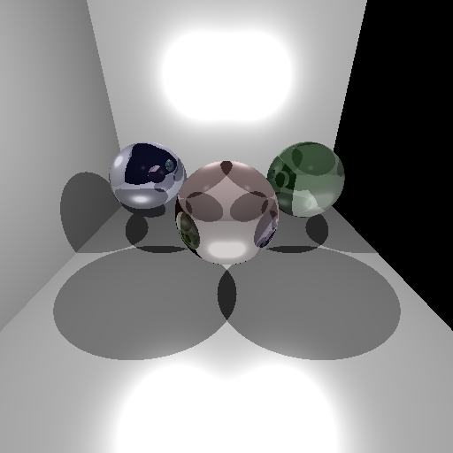

# Raytracer

A Raytracer created in Java as part of a lecture for University of Vienna.

This is rendering an image based on physically correct light refractions and the condition of the surface.

## Quickstart

1. Move into directory:
`cd src`

2. Compile by using makefile:
`make` (On windows, check out  [GnuWin](http://gnuwin32.sourceforge.net/)'s [make](http://gnuwin32.sourceforge.net/packages/make.htm)) 

3. Start the raytracer:
`java Raytracer`

4. Start with `1` and select a file (e.g.: `1`,`4`  is choosing the file _example4.xml_)

5. Print all available attributes with `3`

6. Generate image with `6` (or generate _Refraction Version_ with `7` -- buggy)

7. Check results in _/src_

_To start again, select another file by pressing `1`_ or clean up with `make clean`

### Result

## Classes

* __Shape__: 	abstract class which represents an geometric shape; include the abstract method RayIntersect()

* __Sphere:__ inherit Shape class; represents an sphere with radius and middlepoint

* __Vec3:__	Represents an Vector (x,y,z); implementations of all ordinary vector operations

* __Light:__	Implementations of all possible kinds of light (until now just ambient light!)

* __Ray:__	Representation of an Vector Ray; consists the two vectors 'origin' (pov) and 'destination'

* __Camera:__	Consists the vectors 'position', 'lookat' and 'up' and the integers width and heigth of the image

* __Image:__ 	Handle the operations on a buffered image and saves it in the 'outputfile'

* __Scene:__	Consists the backgroundColor, a camera and light object and an objectlist which contains all Shapes

## Methods
* __Raytracing operations:__: raytrace(), shootRay(), convertXZYInRGB(), trace()

* __XML handling:__ xmlDomParser(), printXML()

* __Creating a scene:__ setScene creats and fill scene object with a camera, light, objects and in generall with all XML attributes

* __InputHandling:__ inputHandler() manages the user input

## Resources

* Tutourial and Lecture Slides

* XML Parser: http://www.tutorialspoint.com/java_xml/java_dom_parse_document.htm-

* Makefile:  http://www.cs.swarthmore.edu/~newhall/unixhelp/javamakefiles.html

* vec3 class: http://r3dux.org/2012/12/vec3-a-simple-vector-class-in-c/

* Raytracing: https://wiki.delphigl.com/index.php/Tutorial_Raytracing_-_Grundlagen_I

* Raycasting: http://www.unknownroad.com/rtfm/graphics/rt_eyerays.html

* Light and Shade:  http://groups.csail.mit.edu/graphics/classes/6.837/F98/Lecture20/RayTrace.java

* Obj Reader: https://www.youtube.com/watch?v=izKAvSV3qk0&feature=youtu.be

* Camera: https://steveharveynz.wordpress.com/2012/12/20/ray-tracer-part-two-creating-the-camera/

* Triangle: https://github.com/idris/raytracer/blob/master/src/raytracer/shapes/Triangle.java; 
http://www.scratchapixel.com/lessons/3d-basic-rendering/ray-tracing-rendering-a-triangle/ray-triangle-intersection-geometric-solution

* Triangle intersection: https://en.wikipedia.org/wiki/M%C3%B6ller%E2%80%93Trumbore_intersection_algorithm
